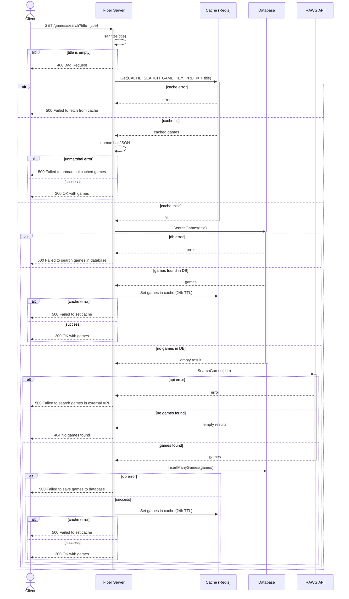

# Games Search Sequence Diagram

```mermaid
sequenceDiagram
    actor Client
    participant Server as Fiber Server
    participant Cache as Cache (Redis)
    participant DB as Database
    participant RAWG as RAWG API

    Client->>+Server: GET /games/search?title={title}
    
    Server->>Server: sanitize(title)
    alt title is empty
        Server-->>Client: 400 Bad Request
    end

    Server->>+Cache: Get(CACHE_SEARCH_GAME_KEY_PREFIX + title)
    alt cache error
        Cache-->>Server: error
        Server-->>Client: 500 Failed to fetch from cache
    else cache hit
        Cache-->>Server: cached games
        Server->>Server: unmarshal JSON
        alt unmarshal error
            Server-->>Client: 500 Failed to unmarshal cached games
        else success
            Server-->>Client: 200 OK with games
        end
    else cache miss
        Cache-->>-Server: nil

        Server->>+DB: SearchGames(title)
        alt db error
            DB-->>Server: error
            Server-->>Client: 500 Failed to search games in database
        else games found in DB
            DB-->>Server: games
            Server->>Cache: Set games in cache (24h TTL)
            alt cache error
                Server-->>Client: 500 Failed to set cache
            else success
                Server-->>Client: 200 OK with games
            end
        else no games in DB
            DB-->>-Server: empty result

            Server->>+RAWG: SearchGames(title)
            alt api error
                RAWG-->>Server: error
                Server-->>Client: 500 Failed to search games in external API
            else no games found
                RAWG-->>Server: empty results
                Server-->>Client: 404 No games found
            else games found
                RAWG-->>-Server: games
                Server->>DB: InsertManyGames(games)
                alt db error
                    Server-->>Client: 500 Failed to save games to database
                else success
                    Server->>Cache: Set games in cache (24h TTL)
                    alt cache error
                        Server-->>Client: 500 Failed to set cache
                    else success
                        Server-->>Client: 200 OK with games
                    end
                end
            end
        end
    end
    deactivate Server
```